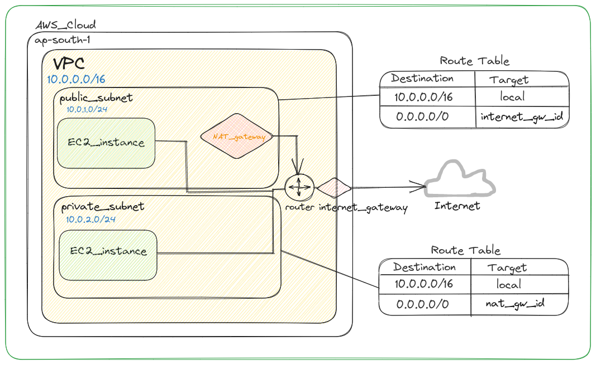

Terraform is an infrastructure as code (IaC) tool that allows users to define and manage infrastructure resources such as: 
 * virtual machines (EC2)
 * networks (VPCs, SGS)
 * dbs (RDS)

The project creates infrastructrue in AWS 
###General arhitecture

This Terraform code creates a basic infrastructure on Amazon Web Services (AWS) using a single main.tf file. The infrastructure includes:
 
 ### VPC
 * Infrastructure is created in default VPC
 ### Security Group: 
 Create a security group that allows:
 * SSH traffic from anywhere (port 22)
 * HTTP traffic from anywhere (port 80)
 ### EC2 instance:
 * Region
 * AMI as AMI IDs are region specific
 

Terraform workflow exectution:

* terraform init
* terraform plan
* terraform apply
* terraform destroy  
